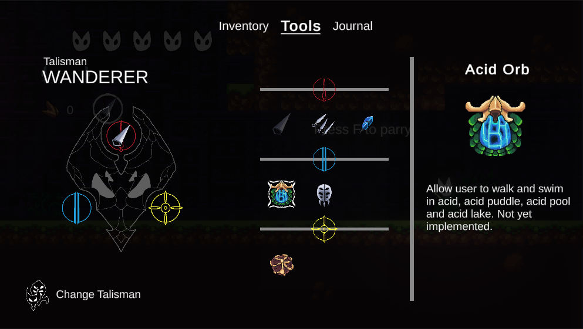
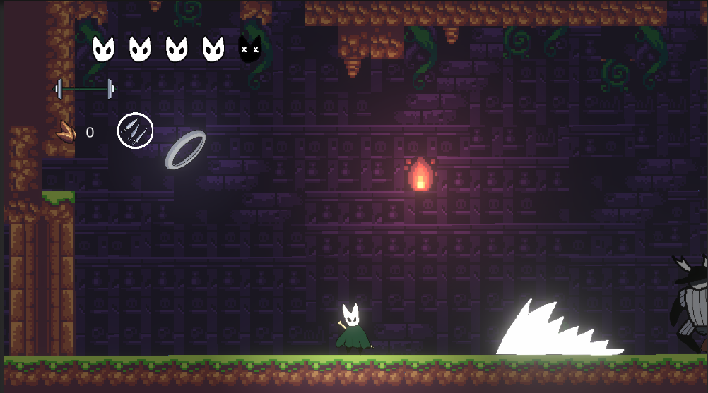
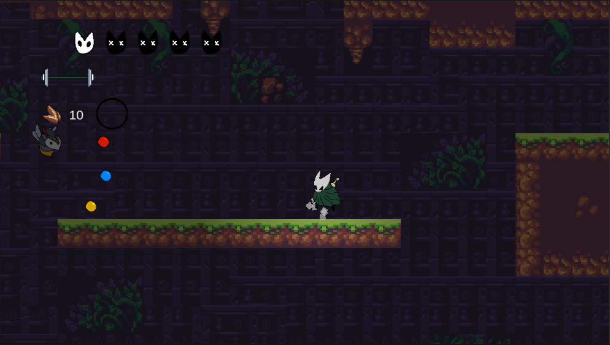

# Melody song

## Summary

A bootleg game.

Unity version: 2022.1.18f1.

## Table of contents

- [Melody song](#melody-song)
  - [Summary](#summary)
  - [Table of contents](#table-of-contents)
  - [Demo images](#demo-images)
  - [Control](#control)
    - [Keyboard](#keyboard)
  - [Design document](#design-document)
    - [Packages used](#packages-used)

## Demo images

## Control

Jump near ledge to grab them.

Hold Jump to jump higher.

Attack while holding up arrow to do an upward attack.

Attack while holding down arrow and midair to do an pogo attack.

Silk skill:

- No vertical input: Heal 3HP. Cost 8 silk.

- Up input (press silk skill while holding up): Gossamer Storm. Cost 6 silk.

- Down input: Silk Burst projectile. Cost 4 silk.

### Keyboard

- X - Jump.
- Q - Silk skill
- F - Parry
- C - Attack
- Z - Dash
- V - Use tools
- I - Open inventory

## Design document

### Packages used

- Cinemachine
- InputSystem
- URP
- A\* Pathfinding

